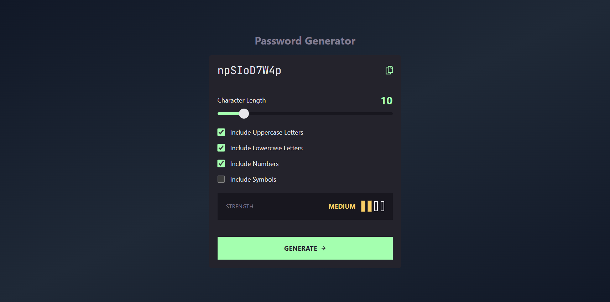

# Frontend Mentor - Password generator app solution

This is my solution to the [Password generator app challenge on Frontend Mentor](https://www.frontendmentor.io/challenges/password-generator-app-Mr8CLycqjh).

## Table of contents

- [Overview](#overview)
  - [The challenge](#the-challenge)
  - [Screenshot](#screenshot)
  - [Links](#links)
- [My process](#my-process)
  - [Built with](#built-with)
  - [What I learned](#what-i-learned)
  - [Continued development](#continued-development)
- [Author](#author)

## Overview

### The challenge

Users should be able to:

- Generate a password based on the selected inclusion options
- Copy the generated password to the computer's clipboard
- See a strength rating for their generated password
- View the optimal layout for the interface depending on their device's screen size
- See hover and focus states for all interactive elements on the page
- Experience smooth animations when generating new passwords
- Enjoy enhanced visual feedback for all interactions (copy, generate, slider, checkboxes)
- Witness staggered animations for strength indicator bars

### Screenshot



**✨ Enhanced with smooth animations and delightful micro-interactions for an improved user experience!**

### Links

- Solution URL: [My solution on Frontend Mentor](https://www.frontendmentor.io/solutions/password-generator-app-with-react-typescript-and-tailwindcss-3KSLGzmClm)
- Live Site URL: [live password generator app](https://qs3h.github.io/Password-Generator-App/)

## My process

### Built with

- Semantic HTML5 markup
- CSS custom properties
- Flexbox
- CSS Animations and Transitions
- Mobile-first workflow
- [React](https://reactjs.org/) - JavaScript library
- [TypeScript](https://www.typescriptlang.org/) - For type safety
- [Vite](https://vitejs.dev/) - Build tool and development server
- [Tailwind CSS](https://tailwindcss.com/) - Utility-first CSS framework

### What I learned

This project was a great opportunity to practice several key React and TypeScript concepts:

**Custom Hooks Pattern:**
I created a `usePasswordGenerator` hook to encapsulate all password-related state and logic, making the code more modular and reusable:

```typescript
const { password, options, strength, setOptions, generateNewPassword } =
  usePasswordGenerator();
```

**Cryptographically Secure Random Generation:**
I learned to use the Web Crypto API (`crypto.getRandomValues`) instead of `Math.random()` for generating secure passwords:

```typescript
const randomArray = new Uint32Array(1);
crypto.getRandomValues(randomArray);
const randomIndex = randomArray[0] % charSet.length;
```

**Password Strength Calculation:**
Implemented a comprehensive strength calculation algorithm that considers both password length and character variety:

```typescript
export const calculatePasswordStrength = (
  password: string,
  options: PasswordOptions
): StrengthResult => {
  // Calculates strength based on length and character variety
  // Returns level (0-4) and label (TOO WEAK to VERY STRONG)
};
```

**Keyboard Shortcuts:**
Added keyboard shortcut support (Ctrl+G / Cmd+G) for generating new passwords, improving user experience:

```typescript
useEffect(() => {
  const handleKeyDown = (event: KeyboardEvent) => {
    if ((event.ctrlKey || event.metaKey) && event.key === "g") {
      event.preventDefault();
      generateNewPassword();
    }
  };
  // ...
}, [generateNewPassword, options]);
```

**Clipboard API Integration:**
Implemented modern clipboard functionality with proper error handling and user feedback:

```typescript
await navigator.clipboard.writeText(password);
setCopied(true);
```

**Advanced Animations and UX Enhancements:**
Added comprehensive animation system to improve user experience:

```typescript
// Password generation animation with transform effects
className={`transition-all duration-300 transform ${
  isAnimating ? 'scale-105 opacity-80 translate-y-1' : 'scale-100 opacity-100 translate-y-0'
}`}
```

**Staggered Animations:**
Implemented staggered animations for strength indicator bars:

```typescript
// Staggered bar fill animation
for (let i = 0; i <= strength.level; i++) {
  setTimeout(() => {
    setAnimatedBars((prev) => [...prev, i]);
  }, i * 100); // 100ms delay between each bar
}
```

**Component Architecture:**
Organized the application into reusable, focused components with enhanced interactivity:

- `PasswordDisplay` - Shows password and handles copying with smooth animations
- `PasswordOptions` - Manages configuration options with animated checkboxes and slider
- `StrengthIndicator` - Displays password strength with staggered bar animations
- `GenerateButton` - Triggers password generation with enhanced press feedback
- `ErrorBoundary` - Handles runtime errors gracefully

### Continued development

Areas I'd like to continue improving:

- **Accessibility**: Further enhance ARIA labels and keyboard navigation, including animation preferences for users with vestibular disorders
- **Testing**: Add unit tests for password generation logic, component behavior, and animation sequences
- **Performance**: Optimize re-renders, implement animation performance monitoring, and consider reducing motion for low-performance devices
- **Features**: Add password history, export functionality, password validation rules, or dark/light theme toggle
- **Security**: Consider adding entropy calculation, additional security metrics, and password breach checking
- **Animations**: Explore more advanced animation techniques like spring physics, gesture-based interactions, and micro-interactions

## Author

- Frontend Mentor - [@QS3H](https://www.frontendmentor.io/profile/QS3H)
